**Vehicle Detection Project**

The goals / steps of this project are the following:

* Perform a Histogram of Oriented Gradients (HOG) feature extraction on a labeled training set of images and train a classifier Linear SVM classifier
* Optionally, you can also apply a color transform and append binned color features, as well as histograms of color, to your HOG feature vector. 
* Note: for those first two steps don't forget to normalize your features and randomize a selection for training and testing.
* Implement a sliding-window technique and use your trained classifier to search for vehicles in images.
* Run your pipeline on a video stream (start with the test_video.mp4 and later implement on full project_video.mp4) and create a heat map of recurring detections frame by frame to reject outliers and follow detected vehicles.
* Estimate a bounding box for vehicles detected.

## [Rubric](https://review.udacity.com/#!/rubrics/513/view) Points
### Here I will consider the rubric points individually and describe how I addressed each point in my implementation.  

---

### Histogram of Oriented Gradients (HOG)

#### 1. Explain how (and identify where in your code) you extracted HOG features from the training images.

The code for this step is contained in lines 11 through 34 of the file called `hog_features.py`).  

I started by reading in all the `vehicle` and `non-vehicle` images. Here is an example of one of each of the `vehicle` and `non-vehicle` classes:

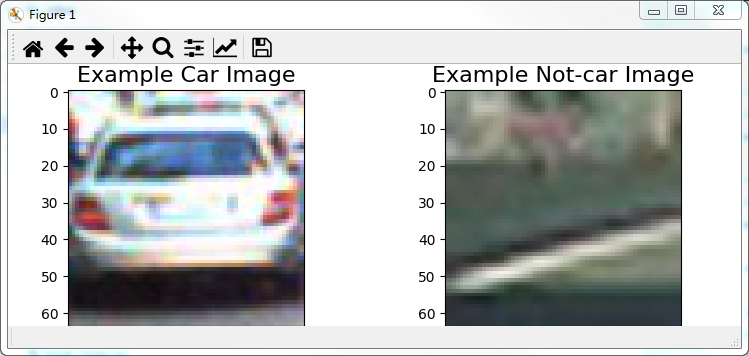

I then explored different color spaces and different `skimage.hog()` parameters (`orientations`, `pixels_per_cell`, and `cells_per_block`). 
I grabbed random images from each of the two classes and displayed them to get a feel for what the `skimage.hog()` output looks like.

Here is an example using the `YCrCb` color space Y' channel and HOG parameters of `orientations=9`, `pixels_per_cell=(8, 8)` and `cells_per_block=(2, 2)`:

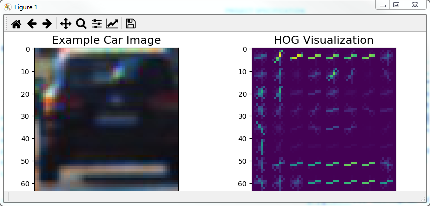


#### 2. Explain how you settled on your final choice of HOG parameters.

I tried various combinations of color spaces and HOG parameters and 
trained a linear SVM using a combination of color histograms, spatial binning and HOG features extracted from color channels.
I discarded RGB color space as it was unstable and had a low accuracy during training. And I eventually settled with the YCrCb color space 
and extracted a combination features from HOG features of all channels, color histograms and spatial binning. 
The final selected HOG feature parameters are `9 orientations`, `8 pixels per cell` and `2 cells per block`, 
color histograms being `16 bins` and spatial binning size being `16 by 16`.
The selected parameters were given in lines 125 through 138 of the file called `classifier.py`.

* Histograms of image channels. An example of Histogram of channels in RGB color space, 32 bins and each bin contains number of pixels falling in the range.

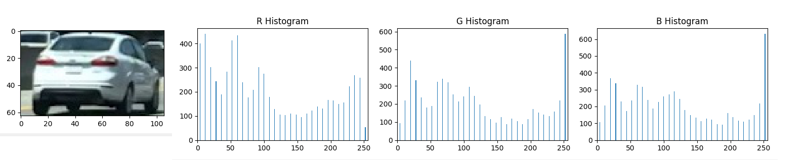

* Image Spatial Binning. An example of spatial binning in RGB color space and size of `32 by 32`. Resize the image to size of `32 by 32` and averaging the pixel values.

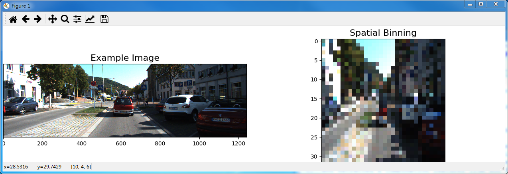

* An example of image HOG features of Y' channel in `YCrCb` color space.


#### 3. Describe how (and identify where in your code) you trained a classifier using your selected HOG features (and color features if you used them).

I trained a Linear SVM using the labeled data from GTI vehicle image database and KITTI vision benchmark suite, but not Udacity data. Data is as follows:
* 8792 car and 8968 non-car samples, which gives a good balanced data.
* `14208` training data and `3552(about 20%)` test data. 

I shuffled the data with `a rand_state to sklearn.model_selection.train_test_split` and normalized the data with [StandardScaler](http://scikit-learn.org/stable/modules/generated/sklearn.preprocessing.StandardScaler.html) 
to avoid some features having dominant impact on classification.
I experimented with SVC types and parameters and ended up with [a Linear SVM](http://scikit-learn.org/stable/modules/generated/sklearn.svm.LinearSVC.html), 
as it gave me a good test accuracy of 99.07% with 1000 iterations and low false positives(when with HOG features from all channels in `YCrCb` color space).
The implementation of classifier is in the function `train_classifier` from lines 74 through 102 in the file called `classifier.py`

### Sliding Window Search

#### 1. Describe how (and identify where in your code) you implemented a sliding window search.  How did you decide what scales to search and how much to overlap windows?

I decided to use HOG sub-sampling search approach, as it only extracted HOG features once per image and had a better performace.
First, I decided only to search `y range from 400 to 656`, to exclude the tree and sky areas.
Based on the training sample image size `64 by 64`, I was experimenting with different scales in search for vehicles.
The scales and y ranges were chosen based on experiments plus processing speed considerations and the final selections were as follows:

| Search size | Scale | Y start and stop | 
|:-----------:|:-----:| :---------------:| 
|     32      | 0.5   |   400, 400+64    | 
|     64      | 1     |   400, 400+128   |
|     96      | 1.5   |   400, 400+256   |
|     128     | 2     |   400, 400+256   |

I was using 2 cells per step for overlapping based on `64` sampling size. The step size would be scaled also with different scale value passed.

The implementation is located in the function of `subsample_search`(lines 23 through 95 in the file `hog_subsample.py`)

#### 2. Show some examples of test images to demonstrate how your pipeline is working.  What did you do to optimize the performance of your classifier?

Ultimately I searched on 4 scales(mentioned above) using YCrCb 3-channel HOG features plus spatially binned color and histograms of color in the feature vector, which provided a nice result.  

Each vehicle will result in multiple overlapping detected windows in different sizes.

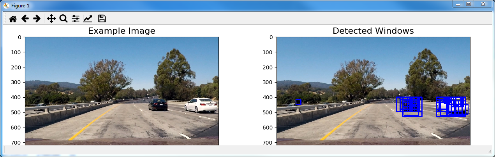

A heatmap could be constructed out of the overlapping detections.

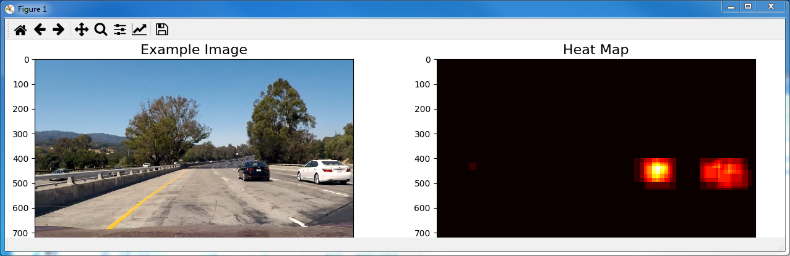

All detections were added to a heatmap. I thresholded the heatmap to discard low confident regions. After thresholding, the heatmap was labled using 
[scipy.ndimage.measurements.label](https://docs.scipy.org/doc/scipy-0.16.0/reference/generated/scipy.ndimage.measurements.label.html). 
Finally, I drew the labeled boxes on top of original image. The heatmap and thresholding were implemented through `line 8 to 48` in the file `heat_map.py`.

To further improve the detection confidence and stability, I stored 5 recent detections. 
I combined the 5 recent detections and thresholding on them to get more smooth and reliable detections. 
The implementation function `detect` is in the file `project.py` from line `19 to 51`.

---

### Video Implementation

#### 1. Provide a link to your final video output.  Your pipeline should perform reasonably well on the entire project video (somewhat wobbly or unstable bounding boxes are ok as long as you are identifying the vehicles most of the time with minimal false positives.)
Here's a [link to my video result](project_video_processed.mp4)


#### 2. Describe how (and identify where in your code) you implemented some kind of filter for false positives and some method for combining overlapping bounding boxes.

I recorded the positions of positive detections in each frame of the video.  I stored 5 recent positive detections.
From the 5 recent combined positive detections I created a heatmap and then thresholded that map to identify vehicle positions.  
I then used `scipy.ndimage.measurements.label()` to identify individual blobs in the heatmap. I then assumed each blob corresponded to a vehicle. 
I constructed bounding boxes to cover the area of each blob detected.  

The implementation for heatmap and thresholding is located through `line 8 to 48` in the file of `heat_map.py` and 
the code for integration of 5 recent positive detections is in the function `detect` from `line 19 to 51` in the file `project.py`.

Here's an example result showing the heatmap from a series of frames of video, the result of `scipy.ndimage.measurements.label()` and the bounding boxes then overlaid on the last frame of video:

### Here are 5 frames and their corresponding heatmaps:

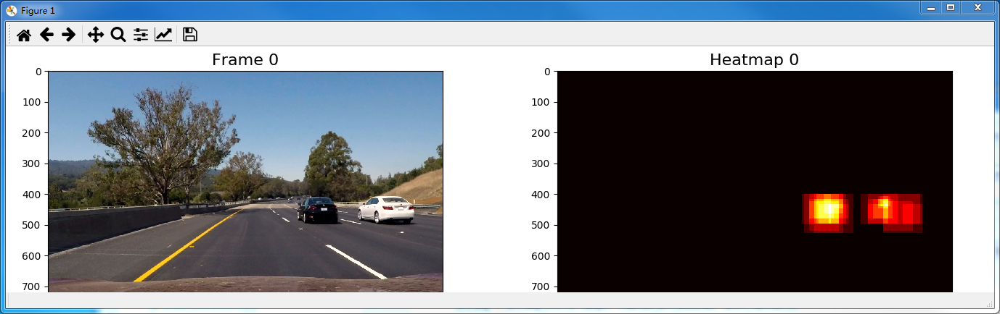

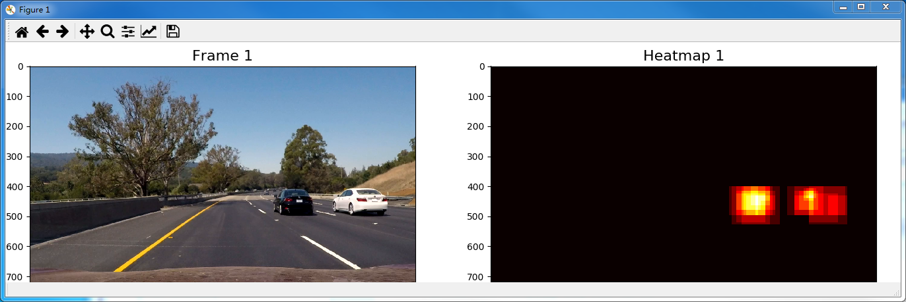

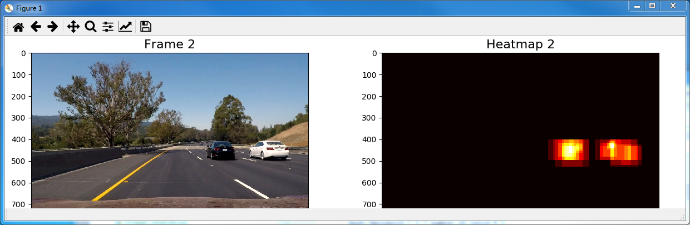

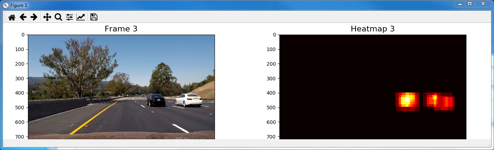

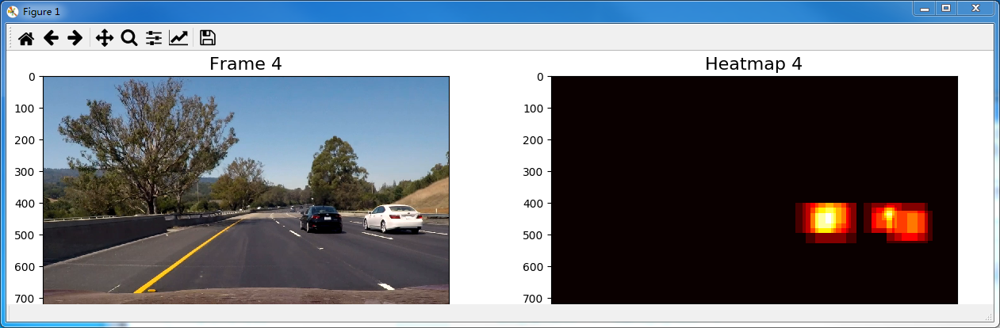

### Here is the output of `scipy.ndimage.measurements.label()` on the integrated heatmap and integrated bounding boxes drawn onto the last frame from all 5 frames:

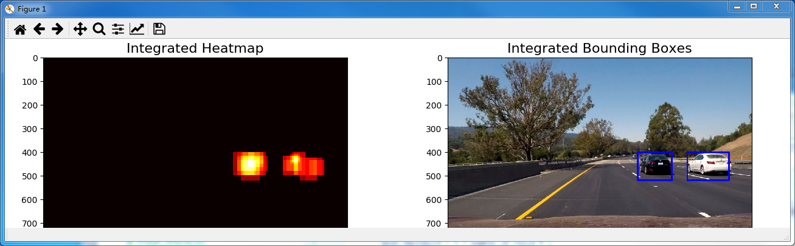

---

### Discussion

#### 1. Briefly discuss any problems / issues you faced in your implementation of this project.  Where will your pipeline likely fail?  What could you do to make it more robust?
I used YCrCb 3-channel HOG features plus spatially binned color and histograms of color for feature extraction. And a Linear SVM was chosen as the classifier. 
If I have more time, I will look into the following areas.

* Detection fails with noises, e.g., the cars in the opposite direction on the other side of guardrail. Detection also fails when car is far away.
* I would like to experiment some more color space and features extractions to find a more stable detection.
* I would like to look into some alternatives to sliding window searching apporach, as it does not look efficient.
* I would like to try Deep Learning CNN approach for classification.

---
### Deep Learning Approach

#### 1. Model
```
_________________________________________________________________
Layer (type)                 Output Shape              Param #   
=================================================================
lambda_1 (Lambda)            (None, 64, 64, 3)         0         
_________________________________________________________________
conv2d_1 (Conv2D)            (None, 30, 30, 16)        1216      
_________________________________________________________________
dropout_1 (Dropout)          (None, 30, 30, 16)        0         
_________________________________________________________________
conv2d_2 (Conv2D)            (None, 13, 13, 32)        12832     
_________________________________________________________________
dropout_2 (Dropout)          (None, 13, 13, 32)        0         
_________________________________________________________________
conv2d_3 (Conv2D)            (None, 5, 5, 64)          51264     
_________________________________________________________________
dropout_3 (Dropout)          (None, 5, 5, 64)          0         
_________________________________________________________________
conv2d_4 (Conv2D)            (None, 1, 1, 128)         204928    
_________________________________________________________________
dropout_4 (Dropout)          (None, 1, 1, 128)         0         
_________________________________________________________________
conv2d_5 (Conv2D)            (None, 1, 1, 1)           129       
=================================================================
Total params: 270,369
Trainable params: 270,369
Non-trainable params: 0
_________________________________________________________________
```

The deep model was learnt from [Max Ritter](https://github.com/maxritter/SDC-Vehicle-Lane-Detection). I simplified the model in the following areas:
* Replaced Pooling with convolutional strides.
* Reduced number of filters, as I believed I didn't need so many for such a simple classification.
* Replaced the final activation function tanh with sigmoid, as sigmoid range is (0, 1), which is more correct, whereas tanh is [-1, 1].

The deep learning approach was quite simple from source code point of view. 
There were only two file `dl.py` and `project_dl.py` and together the total number line of code were about 150(I did not implement scaled search in deep learning approach).
The video processing speed was much much faster - only took a couple of minutes to process.

#### 2. Discussion
With comparison, I believed the deep learning approach was better. one of the key reason was that we totally let machine learnt the pattern for classification with deep learning approach.
Whereas, with the former approach, We extracted HOG, color histograms, image binning features. 
In the process, we might introduce some biases into the input features, as we believed these features were more relevant to the classification.

#### 3. Video
Here's a [link to my video result of deep learning approach](project_video_processed_dl.mp4)


